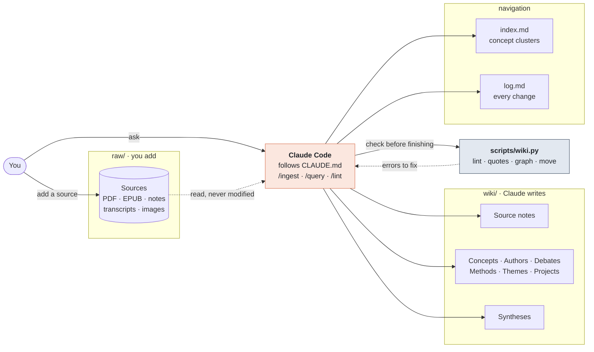
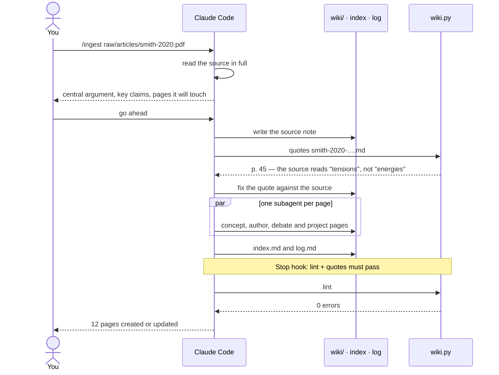
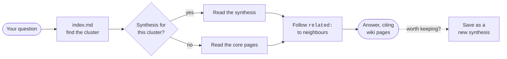
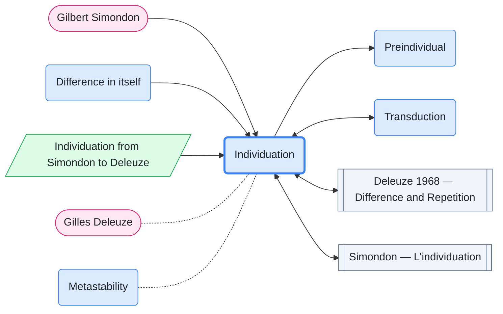

# Zissa Wiki

**A research wiki that writes itself as you read, and checks its own quotes.**

[](https://github.com/MetamusicX/zissa-wiki/actions/workflows/wiki.yml)
[](https://github.com/MetamusicX/zissa-wiki/releases)
[](LICENSE)
[](scripts/README.md)
[](https://claude.ai/code)

Zissa Wiki is a personal knowledge base for academic research, kept in plain markdown and maintained by [Claude Code](https://claude.ai/code). You drop a source into `raw/` and say `/ingest`. Claude reads it, writes a source note, and updates every concept, author, debate and project page the source touches. Every direct quote is then checked, word for word, against the file it came from.

It implements [Andrej Karpathy's LLM Wiki pattern](https://gist.github.com/karpathy/442a6bf555914893e9891c11519de94f): rather than re-deriving knowledge from raw documents on every question (RAG), the model builds a **persistent, interlinked wiki** that compounds with each source. No database, no embeddings, no plugins.

> Part of the **Zissa** family of open, agent-driven tooling, a sibling to [Zissa Agent Orchestra](https://github.com/MetamusicX/zissa-agent-orchestra). *(Formerly `llm-research-wiki`; old links still redirect.)*

## Quickstart

```bash
git clone https://github.com/MetamusicX/zissa-wiki.git my-wiki
cd my-wiki
claude
```

Then, inside Claude Code:

1. Fill in the **Domain Context** at the end of `CLAUDE.md`: your research areas and key thinkers.
2. Write a 2–3 page research map in your own words, save it as `raw/notes/research-map.md`, and run `/ingest raw/notes/research-map.md`. This seeds the wiki with *your* conceptual framework.
3. Add real sources one at a time with `/ingest raw/articles/<file>.pdf`, and supervise the first 5–10 closely.
4. Ask questions with `/query <question>`, and audit with `/lint` every 10–15 ingests.

## How it works



| Layer | Contents | Who writes it |
|---|---|---|
| **`raw/`** | Immutable sources: articles, books, chapters, notes, transcripts, annotations, images | You |
| **`wiki/`** | Interlinked markdown pages: source notes, concepts, authors, debates, syntheses, projects | Claude |
| **schema** | `CLAUDE.md` (the rules), `templates/` (one per page type), `index.md` (clusters), `log.md` (history) | You and Claude |

Raw sources are read once and never modified. The wiki is the layer that answers questions.

## The three workflows

The rules live in [`CLAUDE.md`](CLAUDE.md), which Claude Code loads at the start of every session. Each workflow is also a slash command, defined in [`.claude/skills/`](.claude/skills).

### `/ingest`: one source in, 10–15 pages updated



Claude discusses the source with you **before writing anything**. It reads each page template only when it is about to write that kind of page, and on large ingests it can hand independent page updates to parallel subagents.

### `/query`: answers from the wiki, at constant cost



A flat index gets slow past ~50 pages. So queries run a three-step cascade:

1. **Concept clusters.** `index.md` groups concepts into 4–6 thematic clusters per domain, and a query picks its cluster first.
2. **Synthesis pages.** A cluster's pre-digested overview in `wiki/syntheses/`. One page read instead of six.
3. **`related:` fields.** Every concept and author page lists its 3–5 closest neighbours, so Claude can move between pages without re-scanning the index.

Each step narrows the reading set, which keeps query cost roughly constant at 100+ pages.

### `/lint`: the tool is the hands, the agent is the head

Mechanical checks run as deterministic Python; judgement checks are left to Claude. The result is one prioritised list, and nothing is fixed without your say.

| `wiki.py` checks, exactly and for free | Claude judges, by reading |
|---|---|
| broken links, orphan pages, index drift | duplicate pages |
| missing or invalid frontmatter | contradictions between pages |
| oversize pages, thin source support | stale pages that new sources should have touched |
| **misquotes** against the raw file, and wrong page numbers | weak or generic pages |

## Quotes you can trust

`CLAUDE.md` tells the agent never to invent a citation. `wiki.py quotes` enforces it. For each source note it finds the linked raw file (PDF, EPUB, DOCX, HTML, markdown, text) and checks that every quote appears in it. Only the letters are compared, so PDF extraction noise, ligatures and line-end hyphens don't count as differences. When a quote has drifted, it tells you exactly where:

```text
✗ ERROR (1)
  wiki/source-notes/x-2020.md:14  [quote-differs] departs from the source at
  “…ndividual is a reservoir of energies”; the source reads “…dividual is a reservoir of tensions.”
```

It also catches omissions made without an ellipsis, dropped in-text citations, and page numbers that don't hold the passage. It reads the page numbers printed in the PDF, so book pages and PDF pages don't get confused.

## See your wiki

`wiki.py graph` draws the wiki, or the neighbourhood of one page, as a Mermaid diagram. That renders on GitHub, in Obsidian, and inside any wiki page:

```bash
python3 scripts/wiki.py graph --around individuation
```



<sub>Shapes and colours by page type: concepts rounded blue, authors pill-shaped pink, source notes grey, syntheses green. Solid arrows are links; dotted lines are `related:` entries. `--depth 2` goes a hop further; `--all-edges` adds the links between neighbours. Illustrative demo pages.</sub>

The wiki is plain markdown with relative links, so the folder also opens as an [Obsidian](https://obsidian.md) vault as it is, graph view included.

## Tools

`scripts/wiki.py` is a single-file, zero-dependency Python tool (3.9+). Full reference: [`scripts/README.md`](scripts/README.md).

| Command | What it does |
|---|---|
| `python3 scripts/wiki.py lint` | Links, orphans, index drift, frontmatter, size, thin support. Exits nonzero on any error. |
| `python3 scripts/wiki.py quotes [NOTE]` | Every direct quote against its raw file, plus page numbers. |
| `python3 scripts/wiki.py graph [--around PAGE]` | The wiki's link graph as a Mermaid diagram. |
| `python3 scripts/wiki.py move OLD NEW` | Renames a page and rewrites every link and `related:` entry pointing to it. |

Three things run the checks for you:

- **A Stop hook** ([`.claude/hooks/lint_gate.py`](.claude/hooks/lint_gate.py)). Before Claude finishes a task that changed the wiki, lint must pass and the quotes in changed source notes must match. If not, Claude is sent back to fix them. This is enforced by the harness, not left to the model's memory.
- **GitHub Actions** ([`.github/workflows/wiki.yml`](.github/workflows/wiki.yml)). Every push to your fork is checked the same way.
- **Other agents** (Codex, Gemini CLI, Cursor…). They read [`AGENTS.md`](AGENTS.md), which points them to the same schema and checks.

## Folder structure

```
raw/                  your sources — immutable
  articles/  books/  chapters/  notes/  annotations/  transcripts/  images/  _staging/
wiki/                 written by Claude
  concepts/  authors/  debates/  themes/  methods/  syntheses/  source-notes/  projects/
templates/            one template per page type, read on demand
outputs/              finished deliverables: essays/  slides/  handouts/  tables/
archive/              superseded pages
conversations/        saved sessions
.claude/              /ingest /query /lint skills, the Stop hook, permissions
scripts/wiki.py       lint · quotes · graph · move
conventions.toml      the machine-checkable rules the tool reads
CLAUDE.md             the schema — "the law of the wiki"
index.md · log.md     navigation and history
```

## Page types

| Type | Location | Purpose |
|---|---|---|
| **Source note** | `wiki/source-notes/` | One per ingested source: summary, key claims, verified quotes, connections |
| **Concept** | `wiki/concepts/` | Definition, key thinkers, related concepts, source support |
| **Author** | `wiki/authors/` | Bio, key works, concepts, relevance to your research |
| **Debate** | `wiki/debates/` | Framed positions, key texts, current state |
| **Synthesis** | `wiki/syntheses/` | Evolving argumentative overview of a cluster |
| **Project** | `wiki/projects/<name>/` | Your active research or writing projects |
| **Method** · **Theme** | `wiki/methods/` · `wiki/themes/` | Research methods; clusters that exceed one concept |

Each type has a template in [`templates/`](templates) with YAML frontmatter (`title`, `type`, `tags`, `related`, `created`, `updated`). Claude reads a template only when it is about to write that kind of page, so the always-loaded `CLAUDE.md` stays lean.

## Scaling advice

- Start with your own research map as the first ingest. It seeds the wiki with *your* framework.
- Ingest one source at a time for the first 10–15, and supervise the quality.
- Don't ingest your whole library, only what matters to your active projects. `raw/_staging/` is a holding pen: review it weekly.
- Run `/lint` every 10–15 ingests.
- Create the first synthesis when a cluster has 4+ sources and keeps coming up in queries.
- At ~50 sources the wiki becomes a genuine research tool; at ~100 it's indispensable.

## Template vs. live wiki

This repository is the **template**, the unspecialised seed: placeholder Domain Context, empty `raw/` and `wiki/`. Fork it and make it yours. Please keep your own research content in your fork rather than opening PRs with it here; see [CONTRIBUTING](CONTRIBUTING.md).

My own working wiki is a separate version specialised to my research (Continental philosophy of science, new music studies, posthuman music). It uses the same schema, workflows and templates, plus a populated Domain Context and project folders.

Two adjacent systems in my setup share this DNA but serve other ends. The **MetamusicX wiki** builds atomic entities from research-meeting transcripts, and **Alluvium** turns daily journals into PARA-organised atomic notes. This template is the academic-research variant.

## Requirements

- [Claude Code](https://claude.ai/code): terminal, desktop app, or IDE extension
- Python 3.9+ for `scripts/wiki.py` (optional; the wiki itself is pure markdown)
- [poppler](https://poppler.freedesktop.org/)'s `pdftotext` so `wiki quotes` can read PDFs (optional; `brew install poppler` / `apt install poppler-utils`)

## Credits

- **Pattern:** [Andrej Karpathy, "LLM Wiki"](https://gist.github.com/karpathy/442a6bf555914893e9891c11519de94f) (April 2026)
- **Tooling ideas:** [engram](https://github.com/jeromeetienne/engram) (the tool is the hands, the agent is the head) and [tome](https://github.com/chicken-noodle-chris/tome) (`conventions.toml`)
- **Adaptation and implementation:** [Paulo de Assis](https://github.com/MetamusicX), with Claude Code (Anthropic)

See [CHANGELOG](CHANGELOG.md) for what's new. MIT licensed.
